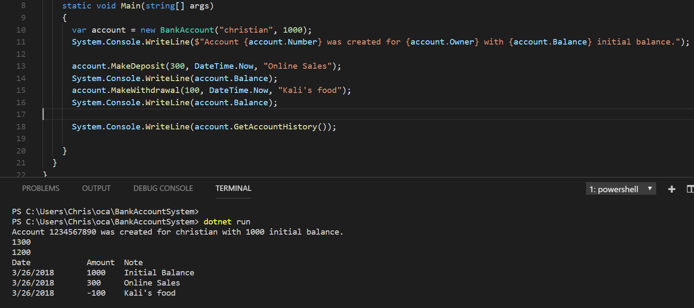

# BankAccountSystem

A console program that resembles a bank account system with features such as:

- 10-digit number that uniquely identifies the bank account
- String that stores the name or names of the owners
- Balance can be retrieved
- Accepts deposits
- Accepts withdrawals
- Initial balance must be positive
- Withdrawals cannot result in a negative balance
- Prints transaction history

